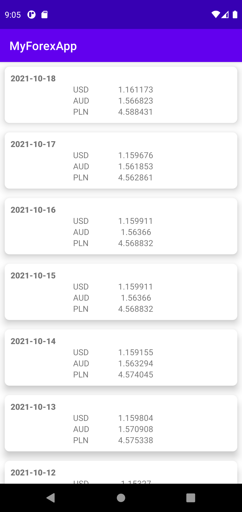
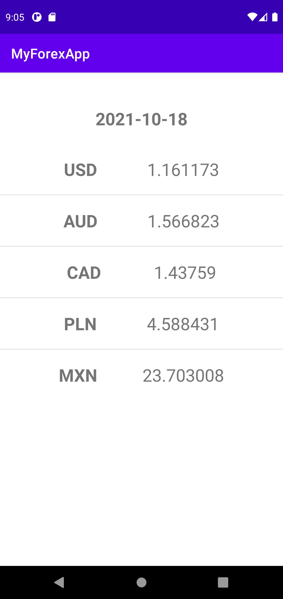

# MyForexApp

This is example app for connection to [**Fixer API**](http://data.fixer.io/api/)

## Libraries

* [Retrofit](https://square.github.io/retrofit/) to call to an HTTP web service
* [Moshi](https://github.com/square/moshi) deserialize JSON to Kotlin data objects
* [Dagger Hilt] (https://github.com/google/dagger/tree/master/java/dagger/hilt) to incorporate Dagger dependency injection

Other patterns and components

* ViewModel
* LiveData
* Coroutines
* Data Binding & View Binding
* RecyclerView
* Navigation
* Safe Args

## Screenshots

